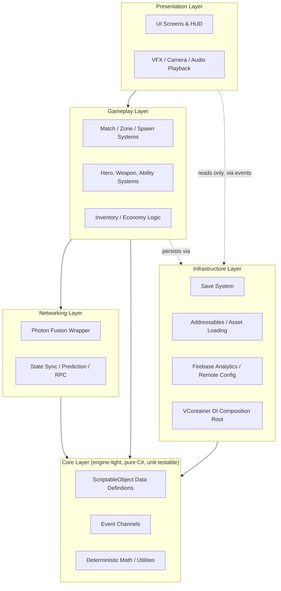
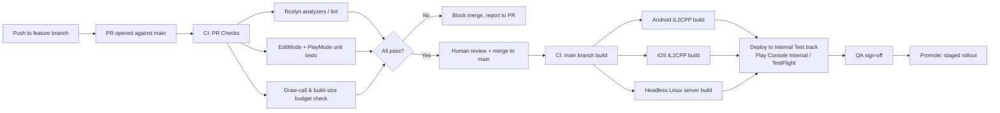
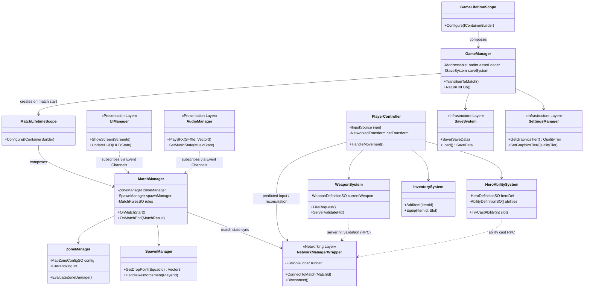
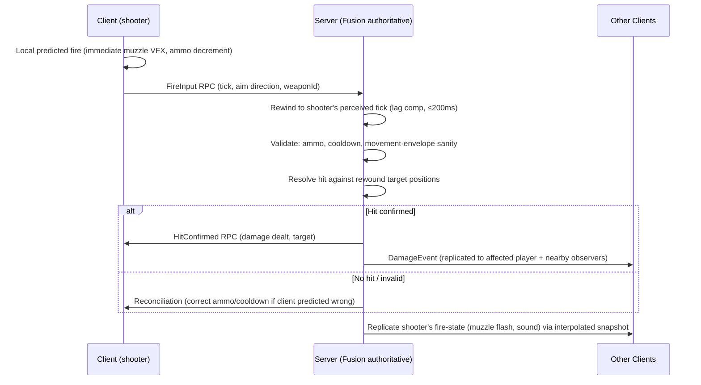

# ZONE STRIKE — Technical Architecture
**Phase 2 of 8 — Engineering Spec**
Version 0.1 (Draft for Approval) · Date: 2026-09-01
Builds directly on [`docs/GDD.md`](GDD.md) — specifically the 8-player (2×4 squad) format (§1.3), the 3GB RAM / 60→30 FPS fallback / ≤800MB download targets, and Photon Fusion as the mandated networking layer.

---

## 0. Architecture Principles (carried through every section below)

- **Server-authoritative, always.** Every gameplay-affecting decision (hit registration, loot spawn, zone damage, ability resolution) is resolved on the server; clients predict and are corrected, never trusted. This is the single architectural decision that most shapes everything below — it's what makes ranked play and anti-cheat (brief requirement) possible at all.
- **Assembly-boundary layering**, not just folder convention — enforced with `.asmdef` files so a dependency-direction violation is a *compile error*, not a code-review catch.
- **Data-driven over hardcoded.** Hero/weapon/ability/map/economy tuning lives in ScriptableObjects + Remote Config, not in code, so Live Ops (Phase 8) can rebalance without an app resubmission.
- **Budget-first.** Every system below states its frame-time, memory, or bandwidth budget *before* implementation starts (Phase 4), not after a profiler finds a problem.

---

## 1. Unity Configuration

| Setting | Value | Rationale |
|---|---|---|
| **Editor version** | Unity 6 LTS (6000.0.x stream, latest patch at each sprint boundary) | Brief mandates "latest stable LTS"; Unity 6 LTS brings GPU Resident Drawer, improved mobile URP batching, and a multi-year support window appropriate for a live-service title |
| **Render pipeline** | URP (Universal Render Pipeline), Mobile Renderer variant | Only viable AAA-quality pipeline for the ≤3GB RAM / 60 FPS mobile target; Built-in RP is legacy, HDRP is desktop/console-only |
| **Scripting backend** | IL2CPP | Required for iOS; also chosen for Android (over Mono) for both performance and a first line of defense against reverse-engineering/cheat-tool injection (Security §11) |
| **Target architectures** | ARM64 only | Google Play has required 64-bit-only submissions since 2021; iOS is ARM64-only already. Dropping ARMv7 shrinks the APK/IPA and simplifies the IL2CPP build matrix — no viable mid-range device in the 2024+ window is 32-bit-only |
| **API Compatibility Level** | .NET Standard 2.1 | Broadest package compatibility (Photon Fusion, Firebase SDKs) while staying IL2CPP-safe |
| **Managed stripping level** | High, with a maintained `link.xml` | Cuts final binary size (download-size budget) while explicitly protecting reflection-dependent code paths (Fusion's networked-property reflection, Addressables, Firebase) from being stripped |
| **Color space** | Linear | Required for correct URP lighting; negligible mobile cost on ARM64 GPUs made in the last 5 years |
| **Graphics APIs** | Android: Vulkan (primary) → OpenGL ES 3.1 (fallback); iOS: Metal only | Vulkan gives the SRP Batcher/GPU-driven rendering path its full benefit; ES3.1 fallback covers the long tail of mid-range Android devices where Vulkan drivers are still buggy |
| **Active Input Handling** | Input System package (new), not legacy Input Manager | Required for clean touch + MFi/Android-gamepad dual-input abstraction (GDD §12) without maintaining two separate input codepaths |

---

## 2. URP Mobile Settings & Quality Tiers

Rather than one fixed quality level, the game **benchmarks the device on first launch** (a short automated timing pass over representative render/compute workloads) and assigns one of three tiers, with a manual override in Settings (accessibility requirement, GDD §20):

| | **Low** (device floor: 3GB RAM class) | **Mid** | **High** |
|---|---|---|---|
| Target framerate | 30 FPS (locked) | 60 FPS | 60 FPS (uncapped path to 90/120 on capable hardware, post-launch consideration) |
| Renderer | URP Mobile Forward | URP Mobile Forward | URP Mobile Forward |
| MSAA | Off | 2x | 4x |
| Shadow distance / cascades | 15m, 1 cascade | 25m, 1 cascade | 35m, 2 cascades |
| Shadow resolution | 512 | 1024 | 2048 |
| Post-processing | None | Color grading only | Color grading + light Bloom |
| Dynamic Resolution Scaling | On, aggressive (0.6–1.0) | On, moderate (0.8–1.0) | Off |
| Texture quality | Half-res streaming cap | Full-res streaming | Full-res streaming |

**60→30 FPS graceful fallback (brief-mandated):** implemented as a *runtime* system, not just a tier choice at boot — a `PerformanceGovernor` (Phase 4) samples rolling frame time every second; if the Mid/High tier can't hold 60 FPS (frame time > 18ms) for 3 consecutive seconds, it first engages Dynamic Resolution Scaling, then drops MSAA, then — only as a last resort — steps the device down to the Low tier's 30 FPS lock, so a thermal-throttling mid-range phone degrades smoothly mid-match instead of stuttering.

**Batching:** SRP Batcher on for all custom-lit shaders; GPU Instancing on for all repeated props (loot crates, foliage, city clutter). **Hard draw-call budget: ≤120 on Low tier, ≤180 on Mid/High**, enforced by a Phase 2 CI check (§9) that fails a build if a reference test scene exceeds it.

---

## 3. Project Architecture — Layering



**Dependency rule (enforced by `.asmdef` references, violated = compile error):** arrows only point *downward*. `Core` depends on nothing else in the project. `Presentation` is the only layer allowed to reference Unity's `UnityEngine.UI`/UI Toolkit assemblies directly — gameplay code never touches a `Canvas`, it raises events that Presentation listens to. This is what makes the "Presentation" and "Gameplay" phases of work (Phase 4 vs Phase 5) genuinely parallelizable by different engineers without merge conflicts.

**Composition & DI:** **VContainer** (not Zenject) — chosen specifically over Zenject for its lower reflection/GC overhead at runtime, which matters directly against the memory/GC budget (§10) on a 3GB-RAM device; Zenject's heavier reflection-based resolution is a known mobile perf cost. A single composition root (`GameLifetimeScope`) wires infrastructure singletons (Save, Addressables loader, Analytics, Audio, Fusion connection) at boot; a per-match `MatchLifetimeScope` wires match-scoped systems (MatchManager, ZoneManager, SpawnManager) and is torn down cleanly on return to the Home Hub — preventing the classic mobile-game memory leak of match state surviving across sessions.

**Event-driven communication:** ScriptableObject **Event Channels** (`GameEventSO<T>`) for cross-system, decoupled communication (e.g., `OnPlayerDowned`, `OnZoneShrinkStarted`, `OnHeroAbilityUsed`) — chosen over a hard-typed C# event bus because it lets designers wire UI/VFX reactions to gameplay events *in the Editor* without touching code, and because it naturally supports the "Presentation never dependency-injects Gameplay" rule above (Presentation just subscribes to the SO asset).

---

## 4. Folder Structure

```
Assets/
├── _Project/
│   ├── Core/                      # ZoneStrike.Core.asmdef — no UnityEngine.UI, no Fusion refs
│   │   ├── Data/                  # ScriptableObject definitions (Hero, Weapon, Ability, MapConfig...)
│   │   ├── EventChannels/
│   │   └── Utilities/
│   ├── Gameplay/                  # ZoneStrike.Gameplay.asmdef
│   │   ├── Match/                 # MatchManager, ZoneManager, SpawnManager
│   │   ├── Heroes/                # HeroAbilitySystem, per-hero ability implementations
│   │   ├── Weapons/                # WeaponSystem, ballistics, hit resolution (client-predicted half)
│   │   ├── Inventory/
│   │   └── Movement/               # PlayerController, camera rig
│   ├── Networking/                 # ZoneStrike.Networking.asmdef
│   │   ├── Fusion/                 # NetworkManager wrapper, NetworkBehaviours
│   │   ├── Sync/                   # Prediction, reconciliation, lag compensation
│   │   └── Matchmaking/            # Client-side matchmaking service calls
│   ├── Infrastructure/             # ZoneStrike.Infrastructure.asmdef
│   │   ├── SaveSystem/
│   │   ├── AssetLoading/            # Addressables wrapper
│   │   ├── Analytics/              # Firebase wrapper
│   │   └── DI/                     # GameLifetimeScope, MatchLifetimeScope
│   ├── Presentation/                # ZoneStrike.Presentation.asmdef
│   │   ├── UI/                     # Screen controllers, HUD
│   │   ├── VFX/
│   │   ├── Audio/                  # AudioManager (playback), mixer routing
│   │   └── Camera/
│   └── Tests/
│       ├── EditMode/                # Pure Core/Gameplay logic unit tests
│       └── PlayMode/                # Integration tests incl. Fusion simulation mode
├── Art/                              # Source art, organized by POI/hero (Addressables-tagged, not shipped raw)
├── Audio/
├── AddressableAssetsData/
└── Settings/                         # URP assets per quality tier, Input System actions asset
```

**Naming/namespace standard:** namespace mirrors folder under `_Project`, e.g. `ZoneStrike.Gameplay.Match`, `ZoneStrike.Networking.Fusion`. One public type per file, filename == type name (standard C# convention, enforced by a Roslyn analyzer in CI, §9).

---

## 5. Networking Architecture (Photon Fusion)

### 5.1 Topology decision: dedicated Server mode, not Host mode
Photon Fusion supports both **Host** (one player's client is the authority — cheaper, no dedicated server cost) and **Server/Dedicated Server** mode (a headless build is the sole authority). Given the GDD's explicit requirements — ranked competitive integrity, anti-cheat, no host-player advantage — **Zone Strike uses Fusion in Dedicated Server mode**, running a headless Linux server build on Photon's cloud fleet (regionally distributed, GDD §13 "regional servers"). The trade-off (server hosting cost vs. Host mode's free-riding on a player's device) is accepted deliberately: a host-authoritative model would hand the hosting player provable competitive advantage (zero-latency self, ability to run local cheat tools with full trust) — unacceptable for a ranked mode, and a reputational risk for a game marketed at 13–17-year-olds who will notice "the host always wins."

### 5.2 Simulation model
- **Tick rate:** 30Hz server simulation (fixed tick), interpolated to display framerate (60 FPS) on clients — 30Hz balances bandwidth/CPU cost against the GDD's TTK target (1.8–2.2s is well-resolved at 30Hz; a 60Hz+ tick is a PC-esports-tier cost not justified by this game's design).
- **Client-side prediction:** local player movement and weapon-fire are predicted immediately client-side for input responsiveness, then reconciled against the server's authoritative state each tick (Fusion's built-in prediction/rollback). A misprediction beyond a small tolerance triggers a smoothed correction (never a hard snap, to avoid visible rubber-banding).
- **Lag compensation (server-side rewind):** the server rewinds hitscan/hit-detection checks to the shooting client's perceived timestamp (bounded to a max rewind window, e.g., 200ms) before validating a hit — standard competitive-shooter lag comp, necessary given mobile network variance.
- **Remote entity interpolation:** other players/projectiles are rendered via buffered interpolation (not extrapolation-heavy), trading a small fixed visual latency for smoothness — appropriate given mobile players are more sensitive to jitter than to the last few ms of latency.

### 5.3 Bandwidth budget
8 players total (GDD §1.3) is the core lever that makes this budget achievable on mobile data connections:

| Category | Budget (per client, per second) | Notes |
|---|---|---|
| Player state (7 remote players) | ~4.5 KB/s | Position/rotation/anim-state delta-compressed, quantized (not full floats) |
| Ability/weapon RPCs | ~1.5 KB/s avg (bursty) | Reliable RPCs only for discrete events (ability cast, hit confirm), never per-frame |
| Loot/zone state | ~0.5 KB/s | Infrequent, mostly on state-change only, not polled |
| **Total target** | **≤8 KB/s down / ≤4 KB/s up** | Conservative enough to be playable on 4G with packet loss headroom; validated against real device/network conditions in Phase 7 |

### 5.4 Reconnect & match recovery
- A client disconnect starts a **60-second reconnect grace window**: the player's hero is left in place under continued server simulation (passive — no input, but not instantly removed, so a squad isn't punished for a teammate's brief network hiccup) with a visible "reconnecting" state to teammates.
- If reconnected within the window: full state resync (snapshot download) and resume.
- If not: the player is converted to Eliminated (consistent with §8 Respawn Policy in the GDD — this does **not** consume the squad's Reinforcement Token, since a disconnect isn't a combat death; a distinct `DisconnectElimination` flag is tracked for post-match stat integrity and anti-abuse review).
- **Server-side match state is authoritative and persisted** (not lost) across the reconnect window, so a full match doesn't collapse from one dropped connection — a scale-appropriate version of "match recovery."

### 5.5 Anti-cheat & security considerations
| Threat (GDD/brief-listed) | Mitigation |
|---|---|
| Speed hacks | Server validates all movement against max-speed/acceleration constraints derived from the ScriptableObject hero definitions; any client-reported position outside the physically-possible envelope is rejected/corrected, never trusted |
| Wall hacks (ESP) | Server only sends the minimum necessary replicated state to each client (interest management: don't replicate a fully-hidden enemy player's exact position to clients who have no line-of-sight/audio reason to know it) — an ESP tool can only display what the client actually receives |
| Memory editing (e.g., health/ammo modification) | All gameplay-critical values (health, ammo, cooldowns) live server-side; client-local copies are display-only predictions that get overwritten every reconciliation tick — editing the client memory value has no effect on the authoritative outcome |
| Packet injection / replay attacks | Photon Fusion's transport uses encrypted, sequenced, authenticated channels; replayed/out-of-order packets are rejected by sequence-number validation at the transport layer |
| Spoofed identity | Server-side session tokens issued at auth (Firebase Auth) and validated on connect; no client-supplied player ID is trusted for match authority |
| Insecure purchases | All IAP receipt validation happens server-side (Unity IAP + server-side receipt verification against Apple/Google, never client-trusted "purchase succeeded" flags) before granting Prisms/cosmetics |

This is a **design-level mitigation list**, not a claim of a fully hardened system — a dedicated third-party security/anti-cheat audit is scheduled as a Phase 7 pre-launch gate, flagged in Risk Analysis (§12 below).

---

## 6. Addressables Strategy

Chosen specifically to hit the **≤800MB initial download** target while still supporting a live-service content cadence (new heroes, maps, seasonal cosmetics) without forcing app-store resubmission for every content drop:

| Addressable Group | Delivery | Contents | Est. Size |
|---|---|---|---|
| `Core-Local` | Bundled in initial install | Boot scene, Home Hub UI, first 2 heroes, base weapon set, core audio/VO, Neo City map | ~420MB |
| `Heroes-Remote` | Remote (CDN, downloaded on demand/first-select) | Heroes 3-8 assets (models/anims/VFX/audio) | ~30MB per hero |
| `Cosmetics-Remote` | Remote, downloaded on purchase/preview | Skins, weapon skins, emotes, kill effects | Variable, ~5-20MB each |
| `SeasonalContent-Remote` | Remote, versioned per Battle Pass season | Season-specific cosmetics, limited-mode assets | Refreshed each season, old season content evictable from local cache |
| `Audio-Streamed` | Streamed (not fully resident) | Music stems, ambient loops | N/A (streamed) |

- **Remote catalog** hosted on a CDN (not Unity's default hosting, for cost/latency control at scale — a Phase 7/8 infra decision, flagged for DevOps sign-off), versioned so a content update doesn't require a binary update — directly serves the Live Ops requirement (GDD, "seasonal updates," "live configuration").
- **Cache management:** Addressables' built-in cache with a size cap (e.g., 1.5GB) and LRU eviction for out-of-season cosmetic bundles — protects device storage on budget phones.
- **Local install budget accounting:** 420MB Core + reasonable OS/store overhead comfortably clears the ≤800MB target with headroom for the two starter heroes' full-fidelity assets; every additional hero/cosmetic a player doesn't own or hasn't previewed costs zero initial download.

---

## 7. ScriptableObject Data Architecture

All designer-tunable values are SO assets, never hardcoded — this is what lets Live Ops (Phase 8) push balance patches primarily through **Remote Config value overrides** layered on top of shipped SO defaults, without an app update for most tuning changes:

- `HeroDefinitionSO` — stats, ability references, mastery XP curve
- `AbilityDefinitionSO` — cooldowns, damage/heal values, VFX/SFX refs
- `WeaponDefinitionSO` — archetype stats per rarity tier (GDD §15)
- `MapZoneConfigSO` — zone ring radii/timings/damage curve (GDD §11) — the single source of truth the Zone Manager reads, so the Phase 3 playtest-driven retuning is a data change, not a code change
- `MatchRulesSO` — match length caps, Reinforcement Token count, scoring rules
- `BattlePassSeasonSO` — 50-tier reward table, XP-per-tier curve
- `EconomyConfigSO` — currency earn rates, store price points

Each SO implements a lightweight `IRemoteOverridable` pattern: on boot, Infrastructure's Remote Config wrapper fetches Firebase Remote Config values and applies any matching overrides on top of the shipped SO defaults in memory (SOs are never mutated on disk) — this is the concrete mechanism behind "Remote Config" in the Live Ops requirement.

---

## 8. Package Selection

| Category | Choice | Why (vs. alternatives considered) |
|---|---|---|
| Render pipeline | URP | Only mobile-viable AAA pipeline in Unity (vs. Built-in RP: legacy/unsupported long-term; HDRP: not mobile-targeted) |
| Networking | Photon Fusion 2 | Brief-mandated; also genuinely the strongest current Unity option for authoritative prediction/rollback netcode at this player-count scale |
| DI | VContainer | Lower GC/reflection overhead than Zenject — directly protects the GC-allocation budget (§10) |
| Input | Unity Input System | Only supported path for clean touch + external-controller abstraction |
| UI | **uGUI (Canvas-based)**, not UI Toolkit runtime | UI Toolkit's runtime UI is newer and still has rougher edges for complex world-space HUD elements (floating damage numbers, nameplates) at the polish bar this brief demands; uGUI is the battle-tested choice for shipped mobile AAA titles today. Revisit UI Toolkit for a post-launch UI overhaul once its mobile runtime story matures further — flagged as a deliberate, revisitable trade-off, not a permanent stance |
| Camera | Cinemachine | Industry-standard, handles the third-person combat camera + spectator free-cam (GDD §9) with minimal custom code |
| Tweening | Unity's `LeanTween` (lightweight) over DOTween | Comparable feature set, smaller footprint/lower license friction for a large UI-animation surface (50-tier Battle Pass UI, cosmetics preview) |
| Analytics/Remote Config/Crash | Firebase (Analytics, Remote Config, Crashlytics) | Brief-mandated (Firebase Analytics, Remote Config explicitly named); one SDK covers three infra needs |
| IAP | Unity IAP | Cross-store (App Store + Play Store) unified API with server-side receipt validation support |
| Object pooling | `UnityEngine.Pool.ObjectPool<T>` (built-in) | No third-party dependency needed; sufficient for this project's pooling needs (projectiles, VFX, UI list items) |
| Testing | Unity Test Framework (EditMode + PlayMode) | Standard; PlayMode tests run against Fusion's local simulation mode for networking logic coverage without a live server |

---

## 9. Build Pipeline & CI/CD



- **CI runner:** GitHub Actions using the `game-ci/unity-builder` action (repo already lives on GitHub, §Phase 1 git workflow) — chosen over Unity Cloud Build for tighter integration with the branch/PR-gated workflow already mandated for this project, and over self-hosted Jenkins for lower ops overhead at this team size; revisit Unity Cloud Build if device-farm testing needs grow beyond Phase 7's device matrix.
- **Build variants:** `Development` (dev console, verbose logging, unstripped for debugging), `Staging` (production code, staging backend endpoints, internal-test signing), `Production` (full stripping/optimization, production backend, store signing) — three distinct Addressables profiles/Remote Config environments to match.
- **Store deployment automation:** Fastlane for both Play Console and App Store Connect metadata/binary upload, gated behind manual QA sign-off (never fully automatic to production — a human always approves the final promote step).
- **Budget gates in CI (fail the build, not just warn):** draw-call count on a reference scene (§2), initial Addressables `Core-Local` group size vs. the 800MB budget, and IL2CPP binary size trend (alerts on >5% week-over-week growth to catch budget creep early rather than at Phase 7).

---

## 10. Performance & Memory Budgets

### 10.1 Frame time budget (60 FPS target = 16.6ms/frame, Mid tier)
| System | Budget | Notes |
|---|---|---|
| Gameplay simulation (client-side prediction, ability logic) | 4.0ms | |
| Rendering (opaque + transparent + shadows) | 7.5ms | Largest single consumer; protected by the draw-call/MSAA tiering in §2 |
| UI (HUD, always-on elements) | 1.5ms | uGUI Canvas batching enforced; HUD elements avoid per-frame layout rebuilds |
| Audio | 0.8ms | |
| Networking (Fusion tick processing, interpolation) | 1.0ms | |
| VFX/Particles | 1.0ms | Pooled, capped active-particle count per hero ability |
| **Headroom** | **~0.8ms** | Deliberately reserved, not allocated — this is the margin the `PerformanceGovernor` (§2) draws on before triggering a tier step-down |

### 10.2 Memory budget (process RAM ceiling)
The brief states two numbers that need reconciling: a **3GB RAM device** as the target hardware floor, and **"less than 2GB RAM"** as a performance requirement. Read together as intended: **the game process itself must stay under ~2GB**, leaving roughly a third of a 3GB device's total RAM for the OS and background processes — which is realistic headroom on Android/iOS mid-range devices. Working budget:

| Category | Budget |
|---|---|
| Textures (streamed, tier-appropriate) | ~450MB peak (Mid/High tier, in-match) |
| Meshes / animation data | ~180MB |
| Audio (loaded, non-streamed portion) | ~90MB |
| Managed heap (C# objects) | ~150MB steady-state |
| Networking buffers | ~25MB |
| UI (uGUI, texture atlases) | ~60MB |
| Native/engine overhead | ~200MB |
| **Total typical in-match** | **~1.15GB** |
| **Hard ceiling (alert threshold in CI/QA)** | **1.8GB** — leaves margin under the 2GB requirement for device/OS variance |

### 10.3 Garbage collection
**Target: zero steady-state per-frame GC allocations during a match.** Enforced via: object pooling for all projectiles/VFX/UI-list-items (§8), avoiding LINQ and `foreach` over `List<T>` boxing in any per-tick hot path (coding convention, §11), struct-based networked state where Fusion supports it, and a Phase 4/7 requirement that the Unity Profiler's GC Alloc track shows 0B/frame in a steady-state combat scenario before a system is considered feature-complete.

---

## 11. Coding Conventions

- **Style:** Microsoft C# conventions — `PascalCase` types/methods/public members, `camelCase` locals/parameters, private fields as `_camelCase`, `SCREAMING_SNAKE_CASE` for `const`. One public type per file; filename matches type name.
- **No public fields** — `[SerializeField] private` + properties where external read access is needed; keeps invariants enforceable and Inspector-exposed fields intentional, not accidental API surface.
- **Null-safety:** nullable reference types enabled project-wide (`#nullable enable`); public API methods validate arguments and fail fast with a clear exception rather than silently no-op-ing.
- **Exception-safety:** networking and save-system code wraps I/O/deserialization in try/catch with typed recovery (corrupt save → fall back to last-known-good, never a crash); gameplay hot-path code avoids exceptions for control flow entirely (perf cost).
- **Async:** `UniTask` (not bare `Task`/coroutines) for async Addressables loads and network operations — chosen for its zero/low-GC-allocation async model, directly protecting §10.3's GC budget, and better Unity main-thread integration than raw `System.Threading.Tasks`.
- **Documentation:** every public type/method carries an XML doc comment (`<summary>`); every gameplay system script additionally carries a top-of-file block comment covering *architecture role*, *optimization notes*, *extension points*, and *networking considerations* — this is the explicit Phase 4 requirement from the brief, standardized here so it's consistent across all ~15 systems rather than ad hoc.
- **Enforcement:** a Roslyn analyzer set (naming, nullable, forbidden-API — e.g., banning `GameObject.Find`, `Camera.main` in hot paths, `LINQ` in `Update()`) runs in CI (§9) as a merge-blocking check, not a style-guide PDF nobody reads.

---

## 12. Illustrative Class Relationships (detailed implementation in Phase 4)


Dotted arrows (`..>`) denote event-channel/RPC decoupled communication rather than a direct object reference — consistent with the "Presentation never holds a Gameplay reference" rule in §3.

### 12.1 Networking sequence — a single weapon-fire, end to end


---

## 13. Internal Design Review (Self-Validation Pass)

- **Coherence check:** every numeric target in this document traces back to a GDD constraint — 8 players → bandwidth budget (§5.3); 3GB RAM/2GB ceiling → memory budget (§10.2); 60→30 FPS fallback (GDD Target Performance) → `PerformanceGovernor` mechanism (§2); ≤800MB download → Addressables local/remote split (§6). No orphaned numbers.
- **Systems interplay simulated:** traced a full match boot: `GameManager` (Core boot) → player queues → `MatchLifetimeScope` spins up → `NetworkManagerWrapper` connects to a dedicated server instance → `ZoneManager`/`SpawnManager` initialize from `MapZoneConfigSO` → in-match fire event flows client→server→clients per §12.1 → match end tears down `MatchLifetimeScope` cleanly, returning to `GameLifetimeScope`'s Home Hub state. No missing handoff found.
- **Anti-cheat check against GDD/brief's explicit threat list:** each of speed hacks / wall hacks / memory editing / packet injection / replay / spoofed auth / insecure purchases has a named, specific mitigation in §5.5 (not a generic "we will have anti-cheat" statement).
- **Scalability check:** dedicated-server topology + regional server requirement (GDD §13) is architecturally supported (headless Linux build target already in the CI pipeline, §9); Addressables remote content model supports adding heroes/maps/seasons without rearchitecting.
- **Maintainability check:** assembly-boundary layering (§3) makes the Phase 4 (code) and Phase 5 (UI/UX) workstreams genuinely parallel-safe, which matters for the Phase 3 12-week sprint plan actually being executable by multiple engineers concurrently.
- **Gap found and resolved during this pass:** initial draft left UI framework unresolved between UI Toolkit and uGUI — resolved in favor of uGUI with an explicit, documented revisit trigger (§8), rather than leaving it ambiguous into Phase 4 where it would block HUD implementation.

### Assumptions requiring explicit confirmation before Phase 3
1. **Dedicated-server hosting cost is accepted** as a recurring operational expense (vs. cheaper Host-mode netcode) — this is a budget/business decision, not purely technical, flagged here because it affects Phase 3 sprint scope (server build/deploy work) and Phase 8 live-ops cost planning.
2. **GitHub Actions + self-managed build fleet** is accepted over Unity Cloud Build — revisit if the team lacks GitHub Actions minutes/self-hosted runner capacity.
3. The **2GB memory ceiling reading** (§10.2) — game process under 2GB, not the whole 3GB device — should be confirmed as the correct interpretation of the brief's two RAM figures.
4. Firebase (Analytics/Remote Config/Crashlytics) assumes a Google Cloud/Firebase account will be provisioned for the project — an account-creation task, not a technical blocker, but needed before Phase 4's Infrastructure layer can be implemented against a real project ID.

### Remaining risks (carried to Phase 3 planning)
- Dedicated server hosting cost/region footprint not yet budgeted in £ terms — needs a Live Ops/business-side estimate before Phase 8 commits to specific regions.
- Vulkan driver inconsistency across the low end of the Android device matrix is a known industry risk — the ES3.1 fallback (§1) mitigates but Phase 7's device compatibility matrix must explicitly test both paths.
- Third-party security/anti-cheat audit (§5.5) is scheduled for Phase 7, meaning any gap found there could require Phase 4 rework — flagged now so it isn't a surprise later.

### Completeness check against the Phase 2 brief
Unity LTS configuration ✅, URP mobile settings ✅, Folder structure ✅, Project architecture ✅, Networking architecture ✅, Photon Fusion integration ✅, Addressables ✅, ScriptableObjects ✅, Dependency graph ✅, Package selection ✅, Build pipeline ✅, CI/CD ✅, Performance budgets ✅, Memory budgets ✅, Namespace standards ✅, Coding conventions ✅, UML diagrams ✅, Class relationships ✅.

---

## 14. Deliverables Summary

- One engineering-spec architecture document (`docs/TECHNICAL_ARCHITECTURE.md`) covering all 18 requested subsections, every budget traceable to a Phase 1 GDD constraint.
- Four explicit assumptions flagged for your confirmation (§13) — most consequential: accepting dedicated-server hosting cost, and the 2GB-ceiling reading of the brief's two RAM figures.
- A risk register carried forward into Phase 3 sprint planning.

**Approve? (Y/N)**
*(A "Y" locks this as the Phase 2 baseline and — per the Git protocol — I'll branch `feature/phase-2-technical-architecture`, diff-review, commit, and push, then stop for your merge. If "N," tell me which section(s) need revision, or answer the §13 assumptions if that's what's blocking approval.)*
